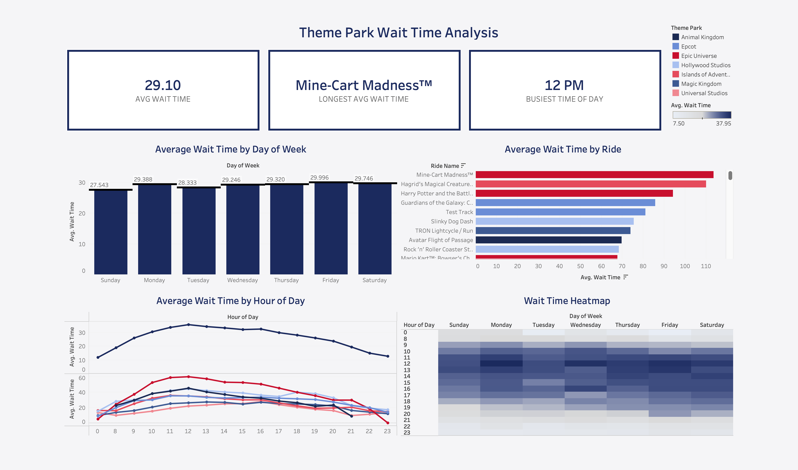
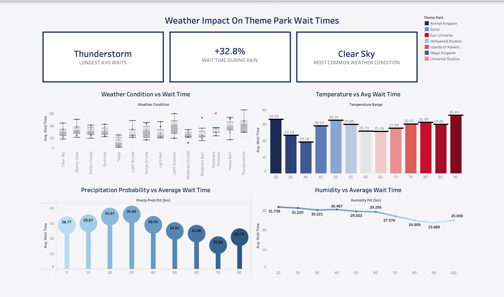
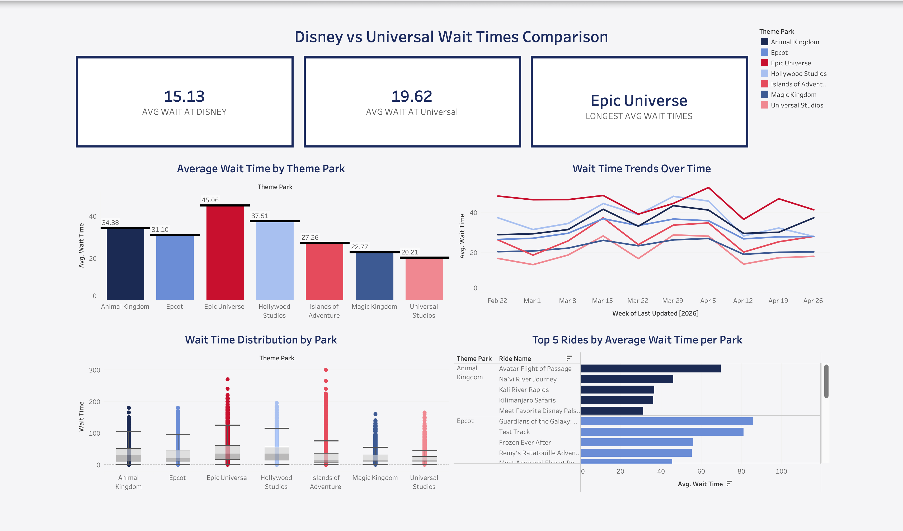

# 🎢 Park Pulse Analytics - A Cloud-Based Pipeline for Theme Park Wait Time Trends

An end-to-end cloud data pipeline that automatically collects real-time ride wait times and weather data across Disney World and Universal Orlando theme parks every 15 minutes, stores it in AWS, and surfaces insights through Tableau dashboards.

## What it does

- Collects wait times from **7 theme parks** (Magic Kingdom, Epcot, Hollywood Studios, Animal Kingdom, Universal Studios, Islands of Adventure, Epic Universe) every 15 minutes
- Concurrently fetches synchronized weather data for each park so every observation has matching weather context
- Stores clean Parquet files in S3 for fast, cost-efficient analytics
- Queries all collected data through Athena using standard SQL
- Visualizes trends and patterns through three Tableau dashboards

## Architecture

## Tech Stack

| Component | Technology |
|---|---|
| Language | Python 3.13 |
| Compute | AWS Lambda |
| Scheduling | AWS EventBridge |
| Storage | Amazon S3 (Parquet) |
| Querying | Amazon Athena |
| Permissions | AWS IAM |
| Logging | AWS CloudWatch |
| Visualization | Tableau Public |
| Libraries | `httpx`, `boto3`, `pandas`, `pyarrow` |

## How it works

**EventBridge** triggers the Lambda function at exactly :00, :15, :30, and :45 of every hour using the cron expression `cron(0/15 * * * ? *)`. That is 96 automatic executions per day with no manual involvement.

**Lambda** runs the Python script which fires all 14 API calls simultaneously using `asyncio` and `httpx`. 7 calls go to the Queue-Times API for ride wait times and 7 go to the Open-Meteo API for current weather conditions, one for each park. The responses are merged into a single DataFrame and uploaded to S3 as a Parquet file.

**S3** stores every pipeline run as a timestamped Parquet file under the `raw-data/` prefix. Parquet was chosen over CSV because it is a columnar format — significantly faster to query and roughly 5-10x smaller in file size.

**Athena** sits on top of the S3 bucket and allows standard SQL queries across all collected files without needing to load the data into a database. Every new file the Lambda deposits is automatically included in queries.

**Tableau** dashboards were built from the collected data and cover three areas of analysis:
- Overall wait time trends across all parks and rides
- Weather impact on wait times
- Disney World vs Universal Orlando comparison

## Why async?

Each pipeline run hits 14 APIs across 7 parks. Sequential calls would introduce a delay between the first and last response, which would skew the timestamps and make weather/wait-time correlation analysis less accurate. Using `httpx.AsyncClient` with `asyncio.gather()` means all 14 observations are captured within milliseconds of each other, keeping the data honest.

## Dataset

Each run produces roughly 370-420 rows, one per ride per park. After several days of collection the dataset contains tens of thousands of rows of continuous 15-minute snapshots. The full schema is below:

| Column | Description |
|---|---|
| `collected_at` | Pipeline execution timestamp (EST) |
| `property` | Resort property (Disney World / Universal) |
| `theme_park` | Individual park name |
| `land_name` | Themed land within the park |
| `ride_name` | Ride name |
| `is_open` | Boolean open/closed status |
| `wait_time` | Posted wait time in minutes (null if closed) |
| `last_updated` | Ride data last-updated timestamp (EST) |
| `temperature_f` | Temperature in Fahrenheit |
| `apparent_temperature_f` | Feels-like temperature |
| `humidity_pct` | Relative humidity percentage |
| `precip_in` | Precipitation in inches |
| `precip_prob_pct` | Precipitation probability percentage |
| `wind_speed_mph` | Wind speed in mph |
| `weather_code` | WMO weather condition code |

## Cost

The entire pipeline runs within AWS free tier limits. Lambda's free tier covers 400,000 GB-seconds of compute per month — at 96 daily runs averaging 10 seconds each at 256 MB of memory, monthly usage comes out to roughly 28,800 GB-seconds. S3 storage and Athena query costs are negligible at this data volume.

## Dashboards

Three dashboards were built in Tableau Public from data queried out of Athena. Each one focuses on a different angle of the data.

**[View on Tableau Public](https://public.tableau.com/app/profile/jon.krenick/viz/ParkPulse-ThemeParkWaitTimeAnalysis/ThemeParkWaitTimeAnalysis)**

### Overall Analysis

### Weather Impact

### Disney vs Universal

## Status

✅ Pipeline live and running — collecting data every 15 minutes automatically
